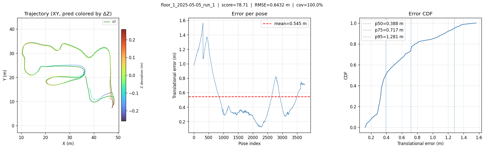

# Hilti × Trimble SLAM Challenge 2026 — Usage Guide

## Overview

Two tasks, one sensor (Insta360 One-RS dual fisheye + IMU):

| Task | Goal | Max score |
|------|------|-----------|
| **SLAM** | Estimate trajectory in any frame (Sim3-aligned at eval) | 2500 pts |
| **Localization** | Estimate trajectory in floorplan frame (SE2-aligned) | 2400 pts |

Trajectory format everywhere: **TUM** — one pose per line:
```
timestamp  tx ty tz  qx qy qz qw
```
Timestamps use a **+10 000 s offset** (e.g. `10026.96` s ≈ 26.96 s into the bag).

---

## Key Files

```
evaluate.py                          # local evaluation + plotting + best-result tracking
challenge_tools_ros/
  colmap_to_tum.py                   # convert COLMAP sparse_txt → TUM

groundtruth/                         # GT TUM files (flat): floor_X_YYYY-MM-DD_run_Z.txt
predictions/                         # your TUM predictions (structured):
  floor_X/
    YYYY-MM-DD_run_Z.txt

colmap_plots/                        # per-run plots + metric reports (structured)
  floor_X/
    YYYY-MM-DD_run_Z.png
    YYYY-MM-DD_run_Z.txt             # metric report

best_results/                        # best score per run — submit from here
  floor_X/
    floor_X_YYYY-MM-DD_run_Z.txt    # TUM, correctly named for submission zip
    floor_X_YYYY-MM-DD_run_Z.png
    floor_X_YYYY-MM-DD_run_Z_report.txt
```

### COLMAP dataset roots (on cluster)

| Path | Contents |
|------|----------|
| `/cluster/scratch/bsekeroglu/dataset/colmap_dataset/colmap_full_run/` | Full-density runs (`cfg_dense`) — **use this** |
| `/cluster/scratch/bsekeroglu/dataset/colmap_dataset/colmap_gt_runs/` | Earlier GT runs (`cfg_10hz_jointBA`) |

---

## Step 1 — Convert COLMAP output to TUM

```bash
source .venv/bin/activate

# Single run
python challenge_tools_ros/colmap_to_tum.py \
  --colmap-dir /cluster/scratch/bsekeroglu/dataset/colmap_dataset/colmap_full_run/floor_2/2025-05-05_run_1/cfg_dense/sparse_txt/0_localized_refined \
  --output predictions/floor_2/2025-05-05_run_1.txt

# Auto-discover all runs under a root (writes to predictions/floor_X/date_run.txt)
python challenge_tools_ros/colmap_to_tum.py \
  --colmap-root /cluster/scratch/bsekeroglu/dataset/colmap_dataset/colmap_full_run \
  --output-dir predictions/ \
  --cfg cfg_dense \
  --model 0_localized_refined
```

**`colmap_to_tum.py` arguments**

| Argument | Default | Description |
|----------|---------|-------------|
| `--colmap-dir` | — | Path to a single `sparse_txt/model` dir |
| `--colmap-root` | — | Root to auto-discover all runs (mutually exclusive with `--colmap-dir`) |
| `--output` | — | Output TUM file (required with `--colmap-dir`) |
| `--output-dir` | `groundtruth/` | Output directory for auto-discovery |
| `--cfg` | `cfg_10hz_jointBA` | Config subfolder name |
| `--model` | `0_localized_refined` | Model subfolder inside `sparse_txt/` |

---

## Step 2 — Evaluate

```bash
# All runs, with plots and best-result tracking (Sim3-aligned, default)
python evaluate.py \
  --gt groundtruth/ \
  --pred predictions/ \
  --plot-dir colmap_plots/ \
  --results-dir colmap_plots/ \
  --best-dir best_results/

# Single run
python evaluate.py \
  --gt groundtruth/floor_2_2025-05-05_run_1.txt \
  --pred predictions/floor_2/2025-05-05_run_1.txt

# Localization task
python evaluate.py --gt groundtruth/ --pred predictions/ --task localization
```

**`evaluate.py` arguments**

| Argument | Default | Description |
|----------|---------|-------------|
| `--gt` | required | GT file or directory |
| `--pred` | required | Prediction file or directory (flat or `floor_X/` structured) |
| `--task` | `slam` | `slam` or `localization` |
| `--plot-dir` | — | Save per-run plots (PNG) here |
| `--results-dir` | — | Save per-run metric reports (TXT) here |
| `--best-dir` | — | Accumulate best results; only overwrites if score improves |
| `--best-aligned` | on | Save Sim3-aligned trajectories to `best-dir` (default) |
| `--best-raw` | — | Save raw (unaligned) trajectories to `best-dir` instead |
| `--max-ts-diff` | `0.05 s` | Max timestamp gap for GT↔pred matching |

### Scoring

```
score(pose) = 100 · exp(−0.461 · error_m)
```
- error = 0 m → 100 pts / error = 10 m → 1 pt
- First 5 s of each run excluded (LiDAR startup)
- Run scores 0 if coverage < 99 % of GT poses matched

---

## Step 3 — Submit

Best results are already named correctly (`floor_X_YYYY-MM-DD_run_Z.txt`).
Collect and zip:

```bash
find best_results/ -name "*.txt" ! -name "*_report.txt" \
  | xargs -I{} cp {} submission/
zip submission.zip submission/*.txt
```

Upload to **https://submit.hilti-challenge.com/**

---

## Example Output

`floor_1_2025-05-05_run_1` — score **78.7 / 100**, RMSE **0.64 m**, coverage **100 %**



- **Left** — XY top-down trajectory. Green = GT, coloured line = prediction after Sim3 alignment. Colour encodes Z deviation (blue = pred below GT, red = pred above GT).
- **Centre** — translational error per pose (mean shown in red).
- **Right** — error CDF with p50/p75/p95 markers.
